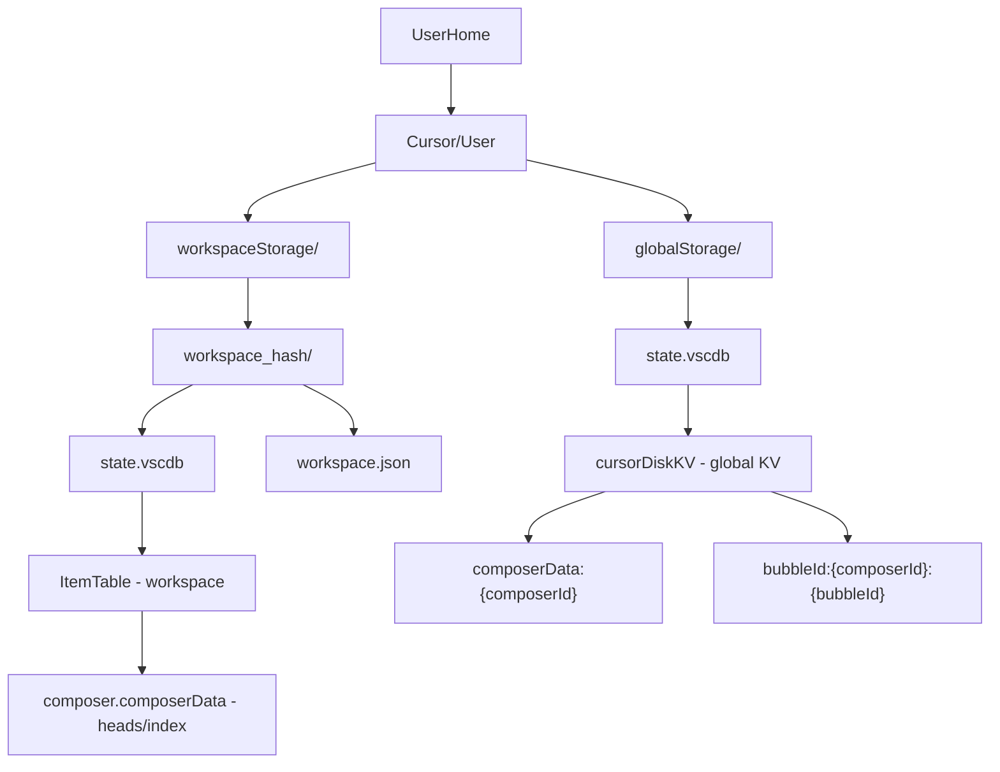
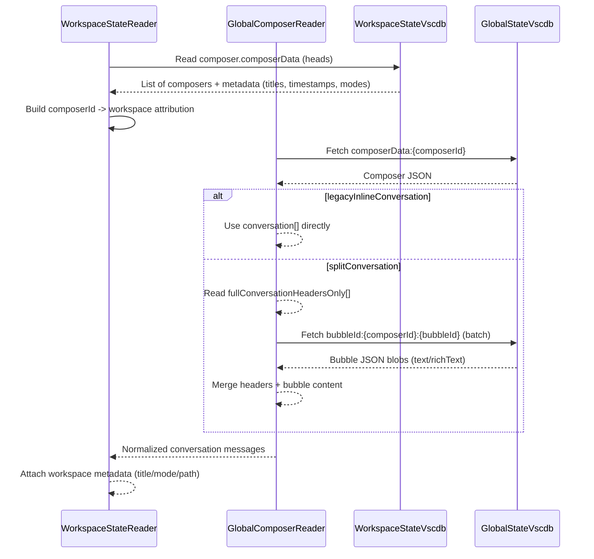
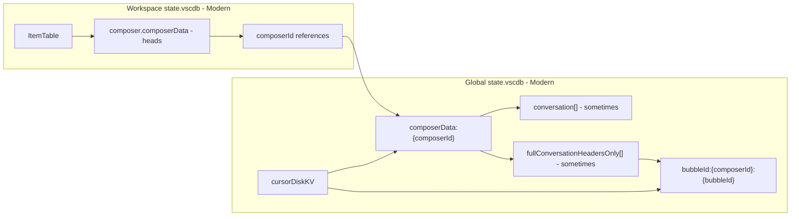

# Cursor Storage Reference: Modern Architecture

This document provides a comprehensive reference for Cursor's **modern split-storage** chat architecture. This is the current architecture used by Cursor, where workspace databases contain metadata/indices while a global database contains the actual content.

**Last Updated**: 2025-12-26  
**Architecture Type**: Split storage (workspace metadata + global content)  
**Schema Version Observed**: `_v: 10` (composerData), `_v: 3` (bubbles)

---

## Overview

In the modern architecture, workspace databases contain metadata and indices (composer "heads"), while a global database contains the actual conversation content. Content may be stored inline or split into headers and per-bubble blobs.

### Key Characteristics

- **Split storage**: Workspace DBs contain metadata, global DB contains content
- **Composer-based**: Conversations are organized as "composers" with unique IDs
- **Bubble split**: Large conversations may split message content into separate bubble records
- **Global attribution**: Composers can be linked to workspaces via composer IDs

---

## Storage Layout (Workspace + Global)



### File Structure

**Workspace Storage**:
- **Location**: `workspaceStorage/<workspace_hash>/state.vscdb`
- **Table**: `ItemTable`
- **Key Pattern**: `composer.composerData` (contains composer heads/index)

**Global Storage**:
- **Location**: `globalStorage/state.vscdb`
- **Table**: `cursorDiskKV`
- **Key Patterns**:
  - `composerData:{composerId}` - Main composer metadata and conversation
  - `bubbleId:{composerId}:{bubbleId}` - Individual message content (split storage)

---

## Dataflow: Reconstructing a Chat with Bubble Split



### Reconstruction Process

1. **Read workspace heads**: Query `composer.composerData` from workspace DB to get list of composers
2. **Build attribution**: Map composer IDs to workspace metadata (title, mode, path)
3. **Fetch composer data**: Read `composerData:{composerId}` from global DB
4. **Handle content format**:
   - **Legacy inline**: Use `conversation[]` array directly if present
   - **Split format**: Read `fullConversationHeadersOnly[]` and fetch individual bubbles
5. **Merge content**: Combine headers with bubble content to reconstruct full messages
6. **Attach metadata**: Link workspace attribution to normalized conversation

---

## Entity / Key-Space View



### Key Relationships

- **Workspace → Global**: Composer IDs from workspace heads reference global composer data
- **Composer → Bubbles**: When using split format, headers reference individual bubble records
- **Attribution**: Workspace metadata provides context (title, mode, workspace path)

---

## Mental Model (ASCII)

```
┌──────────────────────────────────────────────────────────────────────────┐
│ workspaceStorage/<hash>/state.vscdb                                      │
│ └─ ItemTable: composer.composerData → composerId "heads" + metadata     │
│                                                                          │
│ globalStorage/state.vscdb                                                │
│ └─ cursorDiskKV:                                                         │
│   - composerData:{composerId} → conversation OR headers-only             │
│   - bubbleId:{composerId}:{bubbleId} → bubble content (split format)    │
│                                                                          │
│ Reconstruct chat: workspace heads → fetch composerData → maybe fetch    │
│ bubbles → merge → attach workspace attribution → done                    │
└──────────────────────────────────────────────────────────────────────────┘
```

### Summary

- **Two-tier storage**: Workspace metadata + global content
- **Composer-based**: Conversations identified by composer IDs
- **Flexible content**: Inline or split bubble storage
- **Multi-step reconstruction**: Requires joining workspace and global data

---

## Database Schema

### Global Storage: `globalStorage/state.vscdb`

#### Tables

##### `cursorDiskKV`

| cid | name    | type   | notnull | dflt_value | pk  |
| --- | ------- | ------ | ------- | ---------- | --- |
| 0   | `key`   | `TEXT` | 0       | `None`     | 0   |
| 1   | `value` | `BLOB` | 0       | `None`     | 0   |

**Key Patterns**:
- `composerData:{composerId}` - Composer metadata and conversation
- `bubbleId:{composerId}:{bubbleId}` - Individual bubble content

**Foreign keys**: (none)

### Workspace Storage: `workspaceStorage/<hash>/state.vscdb`

#### Tables

##### `ItemTable`

| cid | name    | type   | notnull | dflt_value | pk  |
| --- | ------- | ------ | ------- | ---------- | --- |
| 0   | `key`   | `TEXT` | 0       | `None`     | 0   |
| 1   | `value` | `BLOB` | 0       | `None`     | 0   |

**Key Pattern**: `composer.composerData` - Contains array of composer heads with metadata

**Foreign keys**: (none)

---

## Content Storage Formats

### Format 1: Legacy Inline Conversation

When `conversation[]` array is present in `composerData:{composerId}`:

```json
{
  "composerId": "uuid",
  "conversation": [
    {
      "bubbleId": "uuid",
      "type": 1,
      "text": "Full message content..."
    }
  ]
}
```

**Usage**: Direct access, no bubble fetching required.

### Format 2: Split Bubble Storage

When `fullConversationHeadersOnly[]` is present:

**Step 1**: Read headers from composer data:
```json
{
  "composerId": "uuid",
  "fullConversationHeadersOnly": [
    { "bubbleId": "bubble-uuid-1", "type": 1 },
    { "bubbleId": "bubble-uuid-2", "type": 2, "serverBubbleId": "server-uuid" }
  ]
}
```

**Step 2**: Fetch individual bubbles:
```json
// bubbleId:{composerId}:bubble-uuid-1
{
  "bubbleId": "bubble-uuid-1",
  "type": 1,
  "text": "Full message content...",
  "richText": "..."
}
```

**Step 3**: Merge headers with bubble content to reconstruct full conversation.

---

## Composer Head Structure

Workspace `composer.composerData` contains an array of composer heads:

```json
[
  {
    "composerId": "uuid-1",
    "name": "Chat title",
    "subtitle": "Auto-generated subtitle",
    "createdAt": 1234567890,
    "lastUpdatedAt": 1234567891,
    "status": "completed",
    "forceMode": "chat"
  },
  {
    "composerId": "uuid-2",
    "name": "Another chat",
    "createdAt": 1234567892
  }
]
```

Each head provides:
- **Composer ID**: Reference to global composer data
- **Metadata**: Title, timestamps, mode, status
- **Workspace attribution**: Implicitly linked to the workspace

---

## Related Documentation

- [Old Architecture Reference](storage-reference-old-architecture.md)
- [Main Storage Reference](storage-reference.md)
- [composerData JSON Reference](storage-reference.md#composerdata-json-reference)
- [Bubble JSON Reference](storage-reference.md#bubble-json-reference)
