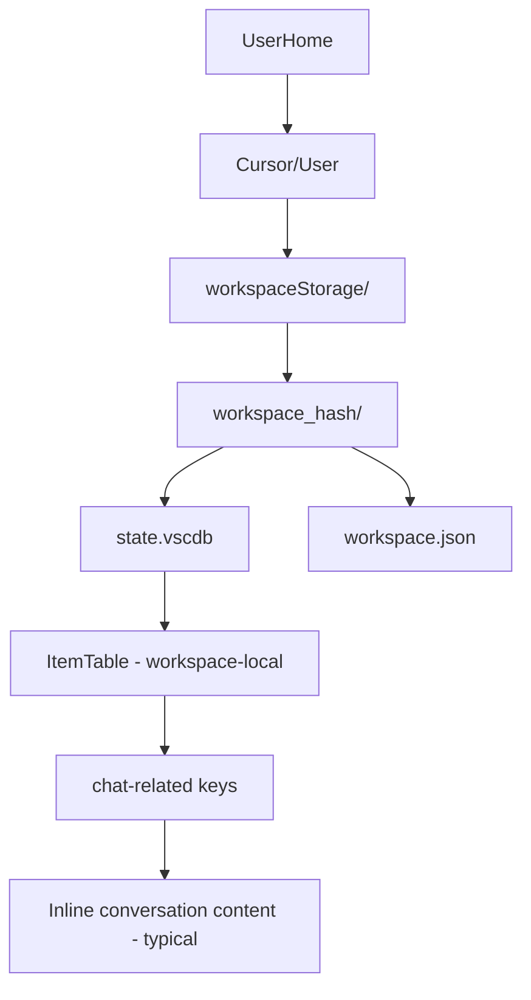
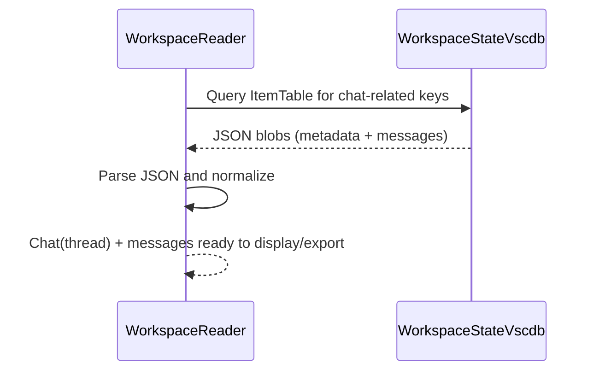
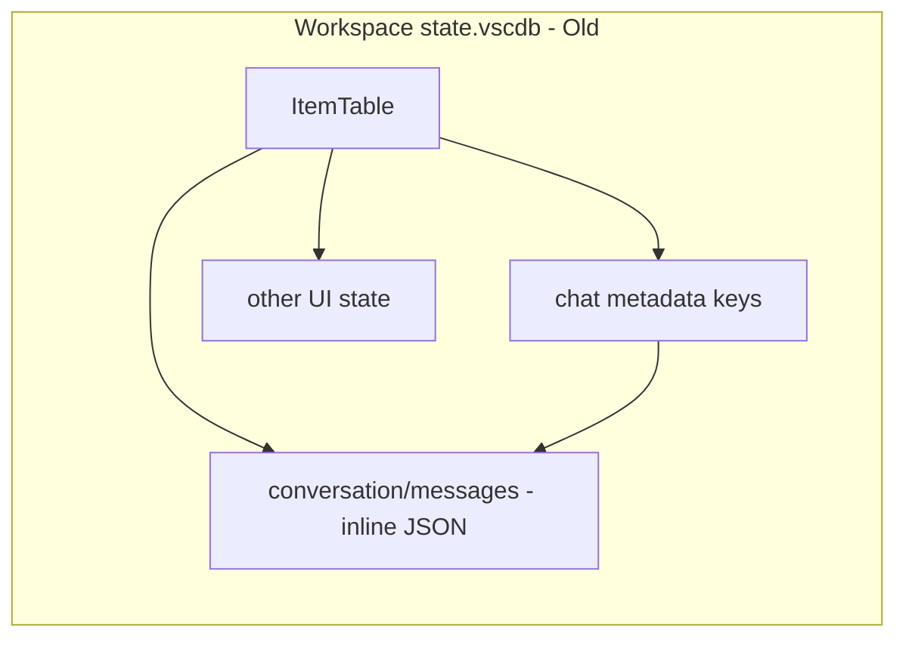

# Cursor Storage Reference: Old Architecture

This document provides a comprehensive reference for Cursor's **old workspace-centric** chat storage architecture. This architecture was used in earlier versions of Cursor and is documented here for reference when working with legacy data.

**Last Updated**: 2025-12-26  
**Architecture Type**: Workspace-centric (pre-split storage)

---

## Overview

In the old architecture, workspace-local `state.vscdb` files contained enough information to reconstruct conversations without requiring a global database join. All chat data (metadata and messages) was stored inline within workspace databases.

### Key Characteristics

- **Self-contained**: Each workspace database contains complete chat data
- **No global dependency**: Chat reconstruction requires only the workspace database
- **Inline storage**: Conversation content stored directly in JSON blobs within workspace ItemTable

---

## Storage Layout



### File Structure

- **Location**: `workspaceStorage/<workspace_hash>/state.vscdb`
- **Table**: `ItemTable` (key-value store)
- **Keys**: Chat-related keys contain both metadata and message content in JSON format

---

## Dataflow: Reconstructing a Chat



### Reconstruction Process

1. **Query workspace database**: Read `ItemTable` for keys matching chat patterns
2. **Extract JSON blobs**: Each key contains a JSON blob with metadata and messages
3. **Parse and normalize**: Extract conversation structure and message content
4. **Ready for use**: Chat thread and messages are immediately available

---

## Entity / Key-Space View



### Key Patterns

- Chat metadata keys: Contain conversation-level information
- Message keys: Contain individual message content (typically inline with metadata)
- UI state keys: Store interface state and preferences

---

## Mental Model (ASCII)

```
┌──────────────────────────────────────────────────────────────────────────┐
│ workspaceStorage/<hash>/state.vscdb                                      │
│ └─ ItemTable: chat keys → JSON blobs (metadata + inline messages)       │
│                                                                          │
│ Reconstruct chat: read workspace DB → parse JSON → done                  │
└──────────────────────────────────────────────────────────────────────────┘
```

### Summary

- **Single source**: All data in workspace database
- **Simple reconstruction**: Read workspace DB → parse JSON → done
- **No joins required**: Everything needed is in one place

---

## Database Schema

### Workspace Storage: `workspaceStorage/<hash>/state.vscdb`

#### Tables

##### `ItemTable`

| cid | name    | type   | notnull | dflt_value | pk  |
| --- | ------- | ------ | ------- | ---------- | --- |
| 0   | `key`   | `TEXT` | 0       | `None`     | 0   |
| 1   | `value` | `BLOB` | 0       | `None`     | 0   |

**Structure**: Simple key-value store where:
- `key`: Text identifier (e.g., chat-related keys)
- `value`: BLOB containing JSON-encoded chat data

**Foreign keys**: (none)

---

## Data Format

### JSON Structure

Chat data stored in `ItemTable` values typically contains:

- **Metadata**: Chat title, timestamps, mode, status
- **Messages**: Inline conversation array with full message content
- **Context**: Attached files, selections, and other context

### Example Pattern

```json
{
  "chatId": "uuid",
  "title": "Chat title",
  "createdAt": 1234567890,
  "messages": [
    {
      "id": "msg-uuid",
      "role": "user",
      "content": "Message content..."
    },
    {
      "id": "msg-uuid-2",
      "role": "assistant",
      "content": "Response content..."
    }
  ]
}
```

---

## Migration Notes

When migrating from old architecture to modern architecture:

- Old workspace databases may still contain legacy chat data
- Modern Cursor versions may still read old format for backward compatibility
- Extraction tools should handle both formats

---

## Related Documentation

- [Modern Architecture Reference](storage-reference-modern-architecture.md)
- [Main Storage Reference](storage-reference.md)
